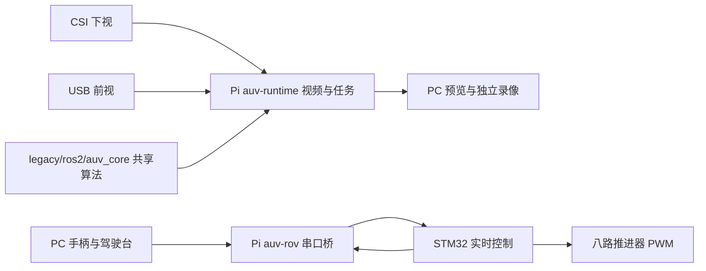

# XJTU 水下机器人软件仓库

面向水下机器人竞赛的 ROV 遥控与 AUV 自主任务项目。树莓派承担视频和高层任务，STM32F405 承担实时姿态控制、推力分配和输出保护；PC 提供驾驶台、数据记录和开发工具。

由于当前平台性能不足和 ROS 方案设计问题，**ROS 相关功能暂时弃用，自动控制开发中心转为 `core/` + `runtime/` 轻量系统**。迁移范围见 [轻量系统路线](docs/lightweight-transition.md)。当前研发重点为 **轻量 AUV 自主任务闭环**；保留八推 ROV 作为稳定控制基线、标定和数据采集工具。开发范围与阶段验收见 [AUV 开发边界](docs/auv-development-boundary.md)。源码可构建、设备已部署和水下测试通过是三个不同状态，详见 [当前状态](docs/project-status.md)。

## 从这里开始

| 目的 | 入口 |
|---|---|
| 启动手柄驾驶台、查参数与接线 | [ROV 操作手册](tools/rov/README.md) |
| 编译、烧录、部署与只读检查 | [维护脚本](tools/rov/MAINTENANCE.md) |
| 理解进程、串口归属与模块边界 | [系统架构](docs/architecture/system.md) |
| 查看目录职责和构建边界 | [仓库布局](docs/architecture/repository-layout.md) |
| 运行轻量任务与摄像头服务 | [Runtime 手册](runtime/README.md) |
| 查协议、验收和历史证据 | [文档中心](docs/README.md) |
| 采集、标注与训练视觉模型 | [P12 标注指南](docs/p12-annotation-guide.md) |

## 当前运行入口

| 模式 | PC / Pi 入口 | STM32 通信归属 | 使用场景 |
|---|---|---|---|
| ROV 遥控 | PC `trial_control_web.py` → Pi `trial_server.py` | Pi `auv-rov` 独占 UART | 手柄、水下调试、视频数据采集 |
| 轻量自主 | Pi `auv_runtime` + `legacy/ros2/auv_core` | Runtime 独占 UART | 无 ROS 的任务一开发与验证 |

ROV 模式可同时运行 Runtime 摄像头服务，但其 `serial.device` 必须为空、运动命令关闭。两种串口控制入口不能同时占用同一设备。PC 的 `console_view.py` 只是驾驶台代理，不能再启动第二个手柄控制进程。



## 当前硬件与控制边界

- MCU：STM32F405RGT6，权威烧录工程为 `firmware/stm32/MDK-ARM/Copy_cup.uvprojx`。
- USART1：H30 IMU，460800；USART2：Pi CRC 协议，115200；USART3：M10 深度计，115200。
- 摄像头：**CSI 下视、USB 前视**；实际设备路径由配置决定。
- 推进器中位为用户实测 **1492 μs**，起转偏移 **±48 μs**；源码速度档位为 ±100 / ±125，具体配置见 ROV 手册。
- 横滚、俯仰调平已获用户水下稳定反馈。回中自动定深、定航向及新诊断为待部署、待实机验证源码。
- M10 约 0.5–1 Hz，相对深度保持不等同于已校准的绝对水深。平移是开环推力指令，没有 DVL 速度闭环。
- 当前实机没有漏水检测；机械爪和云台动作保持禁用。保留 DISARM 默认、显式 ARM、心跳/通信/IMU 超时和输出限幅；定深工作中深度失效会 DISARM。

## 构建与启动

### Windows：ROV 和固件

在仓库根目录的 PowerShell 中执行；维护脚本使用本机 Keil 与已配置调试器。

```powershell
./tools/rov/Maintain-Rov.ps1 build
./tools/rov/Start-RovTrial.ps1
# 可选：额外启用 10 Hz 诊断快照
./tools/rov/Start-RovTrial.ps1 --diagnostic-log
```

驾驶台默认 `http://127.0.0.1:8767/`。启动不会自动 ARM。烧录和部署的前提、参数与读回校验见 [维护手册](tools/rov/MAINTENANCE.md)。

### Linux：轻量 Runtime

依赖安装和设备配置见 [Runtime 手册](runtime/README.md)。

```fish
cmake -S . -B build-lightweight -G Ninja -DCMAKE_BUILD_TYPE=Release
cmake --build build-lightweight -j 3
ctest --test-dir build-lightweight --output-on-failure
./build-lightweight/runtime/auv_runtime runtime/config/runtime.yaml
```

ROS 历史实现见 [归档说明](legacy/ros2/README.md)，当前构建、运行与自动控制开发不需要 ROS 环境。

## 仓库分层

| 目录 | 职责 |
|---|---|
| `firmware/stm32` | 实时控制、传感器、混控、PWM、安全与主机测试 |
| `src/legacy/ros2/auv_core` | ROS 与 Runtime 共用算法核心 |
| `legacy/ros2/` | 暂时弃用的 ROS 节点、接口和启动配置 |
| `runtime` | Pi 原生运行时、双摄采集、HTTP、服务部署 |
| `tools/rov` | PC 驾驶台、Pi 手动桥、日志、录像、维护脚本 |
| `vision` / `annotation` | 离线训练、数据处理与标注 |
| `models` / `datasets` | 模型清单与数据管理约定 |
| `hardware` / `docs` | 接线、坐标系、架构、协议与验收证据 |

日志、录像、数据集、权重、密码和编译产物不进入普通源码提交。记录和测试中的示例值不能替代实测硬件参数。

## 开发与验收

改协议须同步 MCU、Pi、PC 解码器、文档和兼容测试；改控制须先主机测试、Keil 编译，再分阶段实机验收。每次部署记录提交号、配置、HEX 校验、服务版本和验证范围。历史报告是当时的证据，不代表当前设备版本。

当前主要待办是视频优化部署与录像验收、回中自动保持验证、控制饱和诊断，以及自主任务水下标定。详见 [项目状态](docs/project-status.md)。项目约束见 [AGENTS.md](AGENTS.md)。
